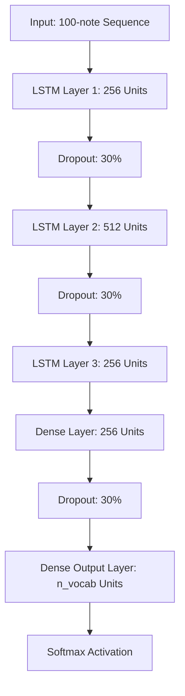

# **Symphony AI — Interactive AI Music Composer & Web Studio**

Symphony AI is a web-based artificial intelligence music workstation that generates and synthesizes multi-genre music on-the-fly. The project features a deep learning LSTM (Long Short-Term Memory) neural network model trained on classical piano compositions (Frédéric Chopin collection), alongside a procedural, real-time drum and bass synthesizer for dark Phonk beats. 

The application is wrapped in a premium, responsive dark-mode dashboard inspired by modern music streaming services, allowing users to listen to generated music directly in the browser.

---

## **📁 Project Structure**

```text
music-generation-tool/
|-- data/                       # Data directory
|   |-- midi/                   # Chopin training MIDI files (.mid)
|   |-- network_input.pkl       # Serialized preprocessed inputs
|   |-- network_output.pkl      # Serialized preprocessed outputs
|   `-- notes.pkl               # Vocabulary of notes/chords
|
|-- models/                     # Saved model weights (.keras checkpoints)
|
|-- output/                     # Generated compositions directory
|   |-- metadata.json           # Metadata details (title, model, genre, date)
|   `-- *.mid                   # Composed outputs
|
|-- src/                        # Source python files
|   |-- __init__.py
|   |-- download_sample.py      # Download demo MIDI tracks
|   |-- preprocess.py           # Preprocesses MIDI notes into pkl files
|   |-- model.py                # Defines LSTM network structure
|   |-- train.py                # Trains the Keras LSTM model
|   `-- generate.py             # Composition generator for Piano & Phonk
|
|-- static/                     # Web assets served by Flask
|   |-- css/
|   |   `-- style.css           # Custom dark UI styling rules
|   `-- js/
|       |-- midiplayer.js       # Local copy of MidiPlayerJS
|       |-- soundfont-player.min.js # Local Soundfont engine
|       `-- script.js           # Interactive UI logic & Web Audio Phonk Synth
|
|-- templates/
|   `-- index.html              # HTML templates rendered by Flask
|
|-- app.py                      # Flask main server application
|-- requirements.txt            # Python dependencies
`-- README.md                   # Project documentation
```

---

## **🧠 Model Architecture**

The core composer model uses a sequential recurrent neural network built with **Keras** and **TensorFlow**. It is designed to handle sequential dependencies in musical compositions:



* **LSTM Layer 1**: 256 memory units. Captures local musical patterns and outputs sequences for the subsequent layers (`return_sequences=True`).
* **Dropout (0.3)**: 30% dropout rate to prevent overfitting on the training compositions.
* **LSTM Layer 2**: 512 memory units. Processes deeper thematic dependencies across longer timelines (`return_sequences=True`).
* **Dropout (0.3)**: Regularization layer.
* **LSTM Layer 3**: 256 memory units. Flattens temporal sequences down into a representative feature vector (`return_sequences=False`).
* **Fully Connected (Dense) Layer**: 256 units. Transforms feature representation.
* **Dense Output Layer**: Features a size equal to the size of the note/chord vocabulary (`n_vocab`).
* **Softmax Activation**: Outputs a probability distribution across all possible notes and chords.

* **Optimizer**: `RMSprop` (standard for Recurrent Neural Networks)
* **Loss Function**: `categorical_crossentropy`

---

## **🏋️ Training & Preprocessing Process**

### **1. Preprocessing (Data Pipeline)**
The preprocessing pipeline parses MIDI files into discrete musical tokens (notes or chords):
- **Single Notes**: Extracted by pitch (e.g., `E4`, `F#5`).
- **Chords**: Represented as a dot-separated string of pitch integers (e.g., `60.64.67` for a C Major chord).
- **Vocabulary Setup**: A unique token set ("vocabulary") is built. Each token is mapped to a distinct integer index (saved in `notes.pkl`).

### **2. Sequence Windowing**
To train the model to predict the next note, we use a sliding window approach:
- **Input Window Size**: 100 notes.
- **Label**: The 101st note in the sequence.
- **Normalization**: The integer sequences are reshaped into `(num_sequences, 100, 1)` and scaled by dividing by the vocabulary size (`n_vocab`) to accelerate gradient descent.

### **3. Execution**
During training, Keras evaluates categorical cross-entropy loss, validating how close the predicted probability distribution matches the actual next note. Model checkpoints are automatically exported to the `models/` directory whenever loss decreases.

---

## **🔊 Real-Time Procedural Phonk Synthesis**

Symphony AI features a **Phonk generation module** that generates high-tempo (138 BPM) syncopated trap structures. Rather than running a slow GPU model, it procedurally generates MIDI structures (featuring a minor pentatonic cowbell lead, sliding bass, kicks, snares, and fast hats) and synthesizes them directly in the browser using the **Web Audio API**:

- **TR-808 Metallic Cowbell**: Synthesized by combining two square-wave oscillators tuned to metallic frequencies (primary frequency $f$ and $1.48f$), passed through a high-Q bandpass filter, and shaped with a fast exponential decay.
- **Reese Bass**: Built by combining two detuned sawtooth waves running through a 350Hz low-pass filter to produce a wide, heavy sub-bass drone.
- **Drum Kits**: Kicks use frequency sweeps (150Hz to 0.01Hz) with rapid volume envelopes. Snares blend triangle wave snaps with high-pass filtered white noise bursts. Hi-hats use short high-pass filtered white noise pulses.

---

## **🚀 How to Run the Project**

### **1. Installation**
Install the necessary dependencies:
```bash
pip install -r requirements.txt
```

### **2. Run Preprocessing & Training (CLI)**
To process the training data and begin model training:
```bash
# Extract midi features into pickle datasets
python -m src.preprocess

# Start LSTM training (Saves checkpoints in models/)
python -m src.train
```

### **3. Run the Web Dashboard**
Start the Flask web application locally:
```bash
python app.py
```
Open **`http://127.0.0.1:5001`** in your web browser. 

* **To Listen**: Click **"Activate Audio"** on the sidebar to enable the Web Audio synthesis engine, select a track, and press play!
* **To Compose**: Input a song title, choose your preferred checkpoint or select "Phonk Beat", and click **"Compose Masterpiece"**.
